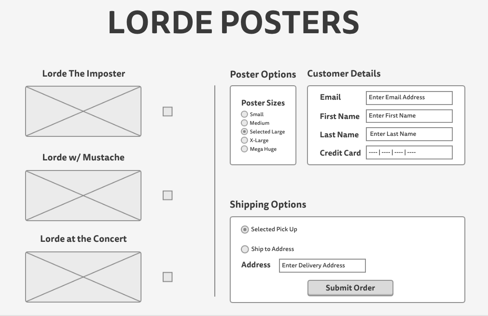

##The Story

Your best friend Shelly Marshe is creating a new website for the sale of awesome Lorde Posters. Unfortunately, Shelly does not have any experience creating great forms to help users process their transactions. That's where you come in! Help Shelly put together working forms to send the proper data to her API.

##Challenge
Using the provided mockup and the user stories. Complete Shelly's form for her. Images have been provided. Be sure to structure the page and styles after the mockup.

###Stories
1. Product Selection
  - Shelly only has three Lorde Posters ("Lorde The Imposter","Lorde with a Mustache", "Lorde at the Concert").
    - Users should be able to select one or all of the posters.
    - Focus should be given on the select box when the page loads.
  - Users should be able to select a size for the posters (S, M, L, XL, MEGAHUGE);
    - Large should be the default size.  
2. Customer Information (Hint: Remember to keep customer/transactional information private)
  - Users should be able to input their email address
  - Users should be able to input their First Name
  - Users should be able to input their Last Name
  - Users should be able to input a credit card number (use 0000-1111-2222-3333 for testing purposes).
3. Shipping information
  - Users should be able to choose to pick up the poster in the store.
  - Users should be to choose to have the posters shipped to an address
  - If the user chooses to ship they should be able to enter in an address
    - The address input field should only show win the 'Ship to Address' option is selected.
4. Order Submission
  - Submit button should only be active once the following have been validated.
    - At least 1 Poster is selected.
    - All Customer Details have been entered.
    - If 'Ship to Address' is selected, that an address is present in the box.

###Mockup

